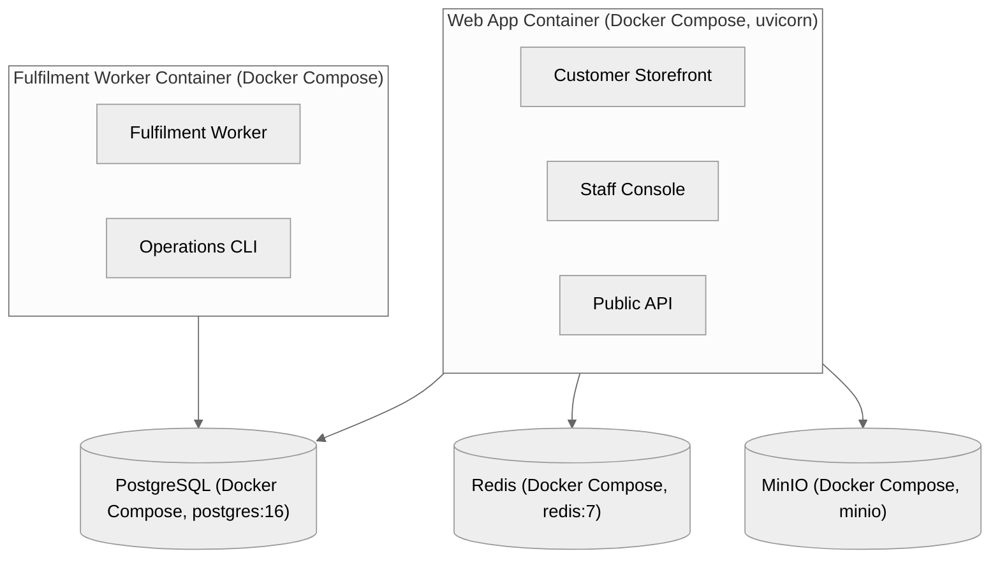

# Architecture

```mermaid
%%{init: {'theme':'neutral'}}%%
graph LR
    subgraph Web_App_Container["Web App Container (Docker Compose, uvicorn)"]
        Customer_Storefront[/"Customer Storefront (Python, FastAPI, Jinja2)"\]
        Staff_Console[/"Staff Console (Python, FastAPI, Jinja2)"\]
        Public_API["Public API (Python, FastAPI)"]
    end
    subgraph Fulfilment_Worker_Container["Fulfilment Worker Container (Docker Compose)"]
        Fulfilment_Worker[\"Fulfilment Worker (Python)"/]
        Operations_CLI>"Operations CLI (Python)"]
    end
    subgraph Business_Services["Business Services (Python)"]
        Business_Services_Catalog["Catalog"]
        Business_Services_Checkout___Pricing["Checkout & Pricing"]
        Business_Services_Orders["Orders"]
        Business_Services_Payments["Payments"]
        Business_Services_Fulfilment_Jobs["Fulfilment Jobs"]
        Business_Services_Inventory["Inventory"]
        Business_Services_Customer_Identity["Customer Identity"]
        Business_Services_Notifications["Notifications"]
        Business_Services_Audit_Trail["Audit Trail"]
    end
    Data_Access_Layer(["Data Access Layer (Python, SQLite)"])
    Third_Party_Integrations(["Third-Party Integrations (Python)"])
    Shared_Web_Toolkit(["Shared Web Toolkit (Python, Jinja2)"])
    Domain_Schemas(["Domain Schemas (Python, Pydantic)"])

    Bookstore_Database[("Bookstore Database")]
    Stripe[["Stripe"]]
    SendGrid[["SendGrid"]]
    Object_Storage[("Object Storage")]
    Twilio[["Twilio"]]

    Customer_Storefront --> Business_Services
    Customer_Storefront --> Shared_Web_Toolkit
    Staff_Console --> Business_Services
    Staff_Console --> Shared_Web_Toolkit
    Staff_Console --> Fulfilment_Worker
    Public_API --> Business_Services
    Public_API --> Third_Party_Integrations
    Business_Services --> Data_Access_Layer
    Business_Services --> Third_Party_Integrations
    Business_Services --> Domain_Schemas
    Data_Access_Layer --> Bookstore_Database
    Third_Party_Integrations --> Stripe
    Third_Party_Integrations --> SendGrid
    Third_Party_Integrations --> Twilio
    Third_Party_Integrations --> Object_Storage
    Fulfilment_Worker --> Business_Services
    Fulfilment_Worker --> Data_Access_Layer
    Fulfilment_Worker --> Domain_Schemas
    Operations_CLI --> Business_Services
    Operations_CLI --> Data_Access_Layer
    Operations_CLI --> Fulfilment_Worker
```

---

### Customer Storefront `Python, FastAPI, Jinja2`

Server-rendered shop where customers browse books, manage a cart, check out and view their orders.

**Path:** `apps/storefront`

**Depends on:** Business Services, Shared Web Toolkit

### Staff Console `Python, FastAPI, Jinja2`

Back-office pages for staff to manage books, inventory, orders, fulfilment jobs, the email outbox and the audit log.

**Path:** `apps/admin`

**Depends on:** Business Services, Shared Web Toolkit, Fulfilment Worker

### Public API `Python, FastAPI`

JSON endpoints for the catalogue, ebook downloads and the Stripe payment webhook.

**Path:** `apps/api`

**Depends on:** Business Services, Third-Party Integrations

### Business Services `Python`

Domain logic for the bookshop, sitting between the web layer and the data repositories.

**Path:** `services`

**Depends on:** Data Access Layer, Third-Party Integrations, Domain Schemas

- **Catalog** — Looks up books and their physical and digital editions.
- **Checkout & Pricing** — Manages guest and signed-in carts, prices them and turns them into paid orders.
- **Orders** — Creates orders and moves them through their lifecycle.
- **Payments** — Charges customers through Stripe and reconciles webhook events with orders.
- **Fulfilment Jobs** — Queues fulfilment work and manages download grants for ebooks.
- **Inventory** — Tracks stock levels for physical editions.
- **Customer Identity** — Registers and authenticates customers and manages sessions.
- **Notifications** — Records and sends transactional emails to customers.
- **Audit Trail** — Records staff actions for the audit log.

### Data Access Layer `Python, SQLite`

Owns the database schema and connection, and exposes one repository per domain area.

**Path:** `data`

**Depends on:** Bookstore Database

### Third-Party Integrations `Python`

Clients for payments, email, text messages and object storage that fall back to local mocks when no credentials are set.

**Path:** `integrations`

**Depends on:** Stripe, SendGrid, Twilio, Object Storage

### Shared Web Toolkit `Python, Jinja2`

Shared templating setup, base layout and form helpers used by the storefront and staff console.

**Path:** `packages/web`

### Domain Schemas `Python, Pydantic`

Shared data models for books, carts, customers, orders, payments and fulfilment.

**Path:** `packages/schemas`

### Fulfilment Worker `Python`

Drains the job queue, granting ebook downloads or shipping physical copies and reconciling inventory.

**Path:** `workers/fulfillment`

**Depends on:** Business Services, Data Access Layer, Domain Schemas

### Operations CLI `Python`

Command-line tool for seeding the database and running fulfilment from the terminal.

**Path:** `tools/cli`

**Depends on:** Business Services, Data Access Layer, Fulfilment Worker

---

## Deployment

**Web App Container** `Docker Compose, uvicorn`
: Serves the storefront, staff console and public API as one ASGI app on port 8000.
  Hosts: Customer Storefront, Staff Console, Public API
  Depends on: PostgreSQL, Redis, MinIO

**Fulfilment Worker Container** `Docker Compose`
: Runs the fulfilment loop through the operations CLI.
  Hosts: Fulfilment Worker, Operations CLI
  Depends on: PostgreSQL

**PostgreSQL** `Docker Compose, postgres:16`
: Database server declared in the compose topology.

**Redis** `Docker Compose, redis:7`
: Cache server declared in the compose topology.

**MinIO** `Docker Compose, minio`
: S3-compatible object store for covers and ebook files.
